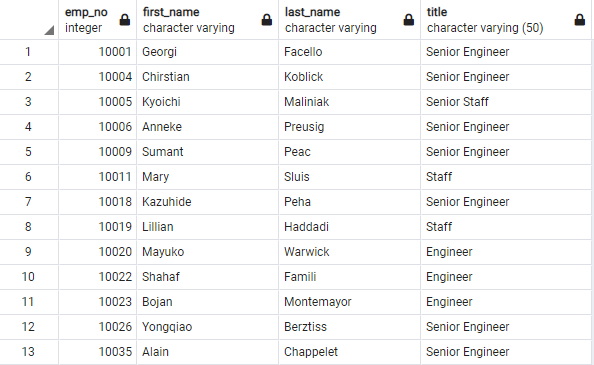
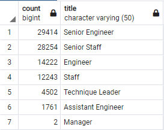
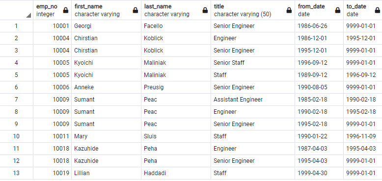

# Pewlett-Hackard-Analysis

## **Overview of the analysis**

the main purpose of this analysis is to perform analysis on a large set of data for a company in regards to its employees. We were assigned to determine the number of retiring
employees for each title and help idenitify employees who are eligible to participate in a mentorship program.

## **Results**

-We were able to create a table (Unique_titles) which shows us the most recent title for employees of retirment age.

-We were to able to creat a table (retiring_titles) which helped us figure out that more than half of the employees of retiring age have senior titles.

-In the retirement_titles table that we have created it enabled us to see every employee who is eligible for retirment and their tenure for every title they had within their career.

